# 📡 Distributed Task Observatory

A self-contained, local-first demonstration platform showcasing modern, production-grade distributed systems designed to enable professional-level agentic development at the most efficient rate possible.

**Test Coverage:**


**Behavioral Tests:**

[](./tests/visual/)

---


[Click here to expand the demo video (MP4)](https://github.com/oddessentials/odd-demonstration/raw/main/screenshots/3.x/demo.mp4)

---

## 🏗️ Architecture


**Authoritative Resources**

- 🗺️ [Blueprints & Design](contracts/blueprint.md)
- 📐 [Invariants](docs/INVARIANTS.md)

**Diagrams**

- 📡 [Observability & Testing](architecture/observability.md)
- ⚙️ [How the system runs](architecture/runtime.md)

```mermaid
flowchart LR
    %% NOTE:
    %% linkStyle indices are order-dependent.
    %% If you add/remove edges above, update the linkStyle ranges below.

    subgraph Interfaces
        Browser["Browser (xterm.js)"]
        WebUI["web-ui-http (nginx)"]
        TUI["odd-dashboard TUI (Rust/ratatui)"]
    end
    subgraph EdgeServices["Edge & Access"]
        WebPTY["web-pty-ws (Rust)"]
        Gateway["Gateway API (Node.js)"]
        ReadModel["Read Model API (Go)"]
    end
    subgraph CoreServices["Core Services"]
        Processor["Processor (Python)"]
        Metrics["Metrics Engine (Go)"]
    end
    subgraph Data["Data & Messaging"]
        RabbitMQ["RabbitMQ (event spine)"]
        Postgres["PostgreSQL (authoritative)"]
        Mongo["MongoDB (event store)"]
        Redis["Redis (cache)"]
    end
    subgraph Observability
        Prometheus["Prometheus"]
        Grafana["Grafana"]
    end
    subgraph Testing["Test Framework"]
        Unit["Unit Tests\n(vitest / go test / pytest / cargo)"]
        Contracts["Contract Validator\nscripts/validate-contracts.ps1"]
        Smoke["Smoke Test\nscripts/smoke-test.ps1"]
        Integration["Integration Gate/Harness\nscripts/integration-gate.ps1\nscripts/integration-harness.ps1"]
        Visual["Playwright Visual Tests\ntests/visual"]
    end

    %% Core runtime connections
    Browser --> WebUI
    WebUI -->|WebSocket| WebPTY
    WebPTY --> TUI
    WebUI -.->|/api| ReadModel
    TUI -.-> ReadModel
    Processor -.-> Postgres
    ReadModel -.-> Postgres
    ReadModel -.-> Mongo
    Metrics -.-> Mongo
    ReadModel -.-> Redis
    Metrics -.-> Redis
    Processor -.-> RabbitMQ
    Metrics -.-> RabbitMQ

    %% Observability (BLUE)
    Prometheus -.-> Metrics
    Grafana -.-> Prometheus

    %% Test framework connections (ORANGE)
    Unit -.-> Gateway
    Unit -.-> Processor
    Unit -.-> Metrics
    Unit -.-> ReadModel
    Unit -.-> WebPTY
    Contracts -.-> Gateway
    Contracts -.-> Processor
    Smoke -.-> Gateway
    Smoke -.-> ReadModel
    Integration -.-> Gateway
    Integration -.-> ReadModel
    Integration -.-> Processor
    Integration -.-> Metrics
    Visual -.-> WebUI

    %% Task creation flow (GREEN)
    TUI -->|"1. User creates task (e.g., press N in TUI)"| Gateway
    Gateway -->|"2. Publish task event"| RabbitMQ
    RabbitMQ -->|"3. Consume event"| Processor
    Processor -->|"4. Process & write results"| Postgres
    ReadModel -->|"5. Query updated views"| Postgres
    ReadModel -->|"6. Provide status updates"| TUI

    %% Node styling
    classDef flowNode fill:#FFEFD5,stroke:#333,stroke-width:1.5px,color:#000;
    class TUI,Gateway,RabbitMQ,Processor,Postgres,ReadModel flowNode;

    %% Observability edges
    linkStyle 13 stroke:#1E90FF,stroke-width:3px;
    linkStyle 14 stroke:#1E90FF,stroke-width:3px;

    %% Test framework edges
    linkStyle 15 stroke:#FF8C00,stroke-width:2.5px;
    linkStyle 16 stroke:#FF8C00,stroke-width:2.5px;
    linkStyle 17 stroke:#FF8C00,stroke-width:2.5px;
    linkStyle 18 stroke:#FF8C00,stroke-width:2.5px;
    linkStyle 19 stroke:#FF8C00,stroke-width:2.5px;
    linkStyle 20 stroke:#FF8C00,stroke-width:2.5px;
    linkStyle 21 stroke:#FF8C00,stroke-width:2.5px;
    linkStyle 22 stroke:#FF8C00,stroke-width:2.5px;
    linkStyle 23 stroke:#FF8C00,stroke-width:2.5px;
    linkStyle 24 stroke:#FF8C00,stroke-width:2.5px;
    linkStyle 25 stroke:#FF8C00,stroke-width:2.5px;
    linkStyle 26 stroke:#FF8C00,stroke-width:2.5px;
    linkStyle 27 stroke:#FF8C00,stroke-width:2.5px;
    linkStyle 28 stroke:#FF8C00,stroke-width:2.5px;

    %% Task flow edges
    linkStyle 29 stroke:#2E8B57,stroke-width:4px;
    linkStyle 30 stroke:#2E8B57,stroke-width:4px;
    linkStyle 31 stroke:#2E8B57,stroke-width:4px;
    linkStyle 32 stroke:#2E8B57,stroke-width:4px;
    linkStyle 33 stroke:#2E8B57,stroke-width:4px;
    linkStyle 34 stroke:#2E8B57,stroke-width:4px;
```



**Legend**

- 🟩 Green: Primary task execution flow
- 🟧 Orange: Test framework pressure
- 🟦 Blue: Observability / monitoring

---

## 🚀 Quick Start (5 minutes)

Get the Distributed Task Observatory running locally with the fewest possible steps.

### 1️⃣ Clone the repo

```bash
git clone https://github.com/oddessentials/odd-demonstration.git
cd odd-demonstration
```

### 2️⃣ Install the dashboard CLI

Choose **one** option:

**Binary (recommended):**

```bash
# macOS / Linux
curl -fsSL https://raw.githubusercontent.com/oddessentials/odd-demonstration/main/install.sh | sh

# Windows (PowerShell)
iwr -useb https://raw.githubusercontent.com/oddessentials/odd-demonstration/main/install.ps1 | iex
```

**npm:**

```bash
npm install -g @oddessentials/odd-dashboard
```

### 3️⃣ Verify prerequisites

```bash
odd-dashboard doctor
```

This checks for Docker Desktop, PowerShell, kubectl, and kind, and tells you exactly what’s missing if anything isn’t installed.

### 4️⃣ Start Docker Desktop

Ensure Docker Desktop is running before continuing.

### 5️⃣ Launch the system

```bash
odd-dashboard
```

That’s it. The TUI will guide you the rest of the way.

➡️ **Next:** Press **L** in the TUI to launch the local cluster.

---

## 🧑‍💻 Developer Quick Start (Guided & Scripted)

This section is for contributors or anyone running the system directly from source.

### Option 1: Rust TUI Launcher (Recommended for dev)

```bash
cd src/interfaces/tui
cargo run --release
```

**What the TUI does:**

1. ✅ Checks Docker, PowerShell, kubectl, and kind
2. 📋 Shows missing tools with install commands
3. 📎 Press **C** to copy a command to your clipboard
4. 🚀 Press **L** to launch the cluster

> 💡 Rust is only required when building the TUI from source.

---

### Option 2: One-shot startup script

Use this if all prerequisites are already installed.

```bash
# Windows
.\scripts\start-all.ps1

# macOS / Linux
pwsh ./scripts/start-all.ps1
```

---

## 🔧 Prerequisites

> The TUI detects and helps you install all of these automatically.

- **Docker Desktop** – container runtime
- **PowerShell Core** – cross-platform scripting
- **kubectl** – Kubernetes CLI
- **kind** – local Kubernetes clusters
- **Rust** – required only for building the TUI from source

---

## 📦 Installation Details

> **Note:** currently releases are unsigned bootstrap builds.
> See [Verifying Releases](./docs/VERIFYING_RELEASES.md) for checksums.

### Verify installation

```bash
odd-dashboard --version
odd-dashboard doctor
```

---

## 🖥️ Interfaces (Quick Overview)

### Rust TUI

- Guided setup & diagnostics
- One-key cluster launch
- Real-time job and system stats
- Alerts from Prometheus
- Built-in UI launcher

**Keyboard shortcuts:**

| Key | Action         |
| --- | -------------- |
| `L` | Launch cluster |
| `N` | New task       |
| `U` | UI launcher    |
| `R` | Refresh        |
| `Q` | Quit           |

---

### Web Terminal

- Browser-based terminal powered by xterm.js
- Pixel-accurate TUI mirroring via PTY streaming
- Session reconnect on refresh
- Fallback dashboard when terminal is unavailable

### Supported Platforms

| OS      | Architecture  | Artifact                        |
| ------- | ------------- | ------------------------------- |
| Windows | x64           | `odd-dashboard-windows-x64.exe` |
| macOS   | Intel         | `odd-dashboard-macos-x64`       |
| macOS   | Apple Silicon | `odd-dashboard-macos-arm64`     |
| Linux   | x64           | `odd-dashboard-linux-x64`       |
| Linux   | ARM64         | `odd-dashboard-linux-arm64`     |

**System Requirements:** 8GB RAM minimum (16GB recommended), 4+ CPU cores, 15GB disk.
See [Support Matrix](./docs/SUPPORT_MATRIX.md) for full hardware requirements and Docker Desktop configuration.

## 🔗 Access Points

After startup, access services via port-forwards:

| Service            | URL                         | Credentials               |
| ------------------ | --------------------------- | ------------------------- |
| **Web Terminal**   | http://localhost:8081       | -                         |
| **Gateway API**    | http://localhost:3000       | -                         |
| ↳ API Docs         | http://localhost:3000/docs  | -                         |
| **Read Model API** | http://localhost:8080/stats | -                         |
| ↳ API Docs         | http://localhost:8080/docs  | -                         |
| **RabbitMQ**       | http://localhost:15672      | guest / guest             |
| **Grafana**        | http://localhost:3002       | admin / admin             |
| **Prometheus**     | http://localhost:9090       | -                         |
| **pgAdmin**        | http://localhost:5050       | admin@example.com / admin |
| **Mongo Express**  | http://localhost:8082       | admin / password123       |
| **RedisInsight**   | http://localhost:8001       | -                         |

---

## 🐳 Docker Hub Images

Pre-built container images are published to Docker Hub for faster integration testing and CI reproducibility.

[View on docker hub here](https://hub.docker.com/u/oddessentials)

### Available Images

| Image                                      | Base             | Size    | Purpose                          |
| ------------------------------------------ | ---------------- | ------- | -------------------------------- |
| `oddessentials/odto-gateway:latest`        | node:20-slim     | ~320 MB | API Gateway (Node.js/TypeScript) |
| `oddessentials/odto-processor:latest`      | python:3.11-slim | ~490 MB | Job Processor (Python)           |
| `oddessentials/odto-metrics-engine:latest` | distroless       | ~23 MB  | Metrics Aggregator (Go)          |
| `oddessentials/odto-read-model:latest`     | distroless       | ~20 MB  | Query API (Go)                   |
| `oddessentials/odto-web-pty-server:latest` | debian:bookworm  | ~80 MB  | PTY WebSocket Server (Rust)      |
| `oddessentials/odto-web-ui:latest`         | nginx:alpine     | ~25 MB  | Web Terminal Frontend (nginx)    |

### Usage

```bash
# Pull latest images
docker pull oddessentials/odto-gateway:latest
docker pull oddessentials/odto-processor:latest
docker pull oddessentials/odto-metrics-engine:latest
docker pull oddessentials/odto-read-model:latest
docker pull oddessentials/odto-web-pty-server:latest
docker pull oddessentials/odto-web-ui:latest

# Run integration tests with pre-built images
docker compose -f docker-compose.integration.yml up -d
```

### Image Tagging

- `:latest` — Current `main` branch build
- `:sha-<commit>` — Exact commit traceability

### CI Integration

Images are automatically built and pushed on every merge to `main`:

- Security: Build/push only runs on `main`, never on PRs or forks
- Contracts are baked into Gateway and Processor images for self-contained tests
- Core services use these pre-built images for <90s runtime (I4 invariant)

> **Note:** Visual regression tests (`tests/visual/`) build `web-pty-server` locally with `target: real` to embed the actual TUI binary. This ensures PR changes to the TUI are tested before merge.

## 🧪 Testing

### Run All Tests

```bash
# Windows
.\scripts\run-all-tests.ps1

# macOS/Linux
pwsh ./scripts/run-all-tests.ps1
```

### Integration Gate

```bash
# Windows
.\scripts\integration-gate.ps1

# macOS/Linux
pwsh ./scripts/integration-gate.ps1
```

### Per-Service Tests

| Service        | Command                                         |
| -------------- | ----------------------------------------------- |
| Gateway        | `cd src/services/gateway && npx vitest run`     |
| Processor      | `cd src/services/processor && pytest tests/ -v` |
| Metrics-Engine | `cd src/services/metrics-engine && go test -v`  |
| Read-Model     | `cd src/services/read-model && go test -v`      |
| TUI            | `cd src/interfaces/tui && cargo test`           |

---

## 📁 Project Structure

```
odd-demonstration/
├── .github/             # CI workflows (GitHub Actions)
├── contracts/           # Event-driven contract layer
│   ├── schemas/         # JSON schemas (event-envelope, job, etc.)
│   ├── fixtures/        # Test fixtures for validation
│   └── VERSIONS.md      # Schema version registry
├── docs/                # Additional documentation
├── infra/
│   ├── k8s/             # Kubernetes manifests (services, mongo, redis, etc.)
│   └── grafana/         # Grafana dashboard JSON
├── scripts/             # Automation & CI scripts
│   ├── start-all.ps1    # One-click cluster startup
│   ├── run-all-tests.ps1
│   ├── integration-gate.ps1
│   ├── check-service-versions.py
│   └── check-schema-compat.py
├── src/
│   ├── interfaces/
│   │   ├── tui/         # Rust TUI (ratatui) with cluster launcher
│   │   └── web/         # xterm.js Web Terminal (Nginx + PTY)
│   └── services/
│       ├── gateway/         # Node.js - API ingress, schema validation
│       ├── processor/       # Python - Job execution worker
│       ├── metrics-engine/  # Go - Event aggregation, MongoDB writer
│       ├── read-model/      # Go - Query API (Postgres, MongoDB, Redis)
│       └── web-pty-server/  # Rust - PTY WebSocket streaming
├── tests/
│   ├── visual/          # Playwright visual regression tests
│   └── fixtures/        # Integration test fixtures
├── audit/               # Session artifacts & implementation walkthroughs
└── MODULE.bazel         # Bazel workspace (polyglot build)
```

---

## 🛑 Cleanup

```bash
# Stop port-forwards (Windows PowerShell)
Get-Job | Stop-Job | Remove-Job

# Stop port-forwards (macOS/Linux - if running in background)
pkill -f "kubectl port-forward"

# Delete cluster (all platforms)
kind delete cluster --name task-observatory
```

---

## 📚 Documentation

- [Beginner Setup Guide](./README_beginner.md) - Step-by-step with prerequisites
- [Contributing](./CONTRIBUTING.md) - Development guidelines
- [Audit](./audit/) - Implementation details and walkthroughs

---

## 📝 License

MIT
