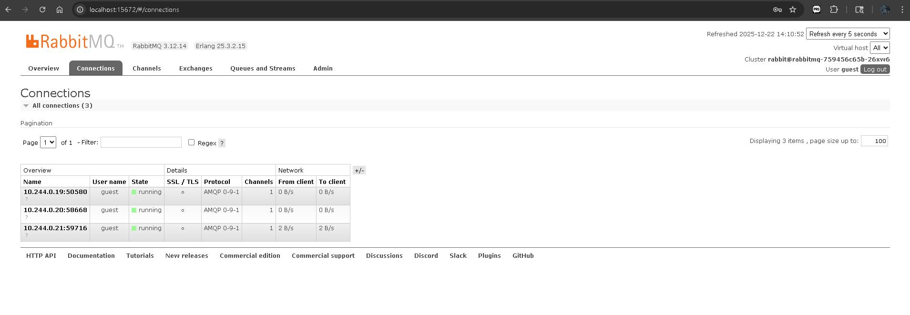
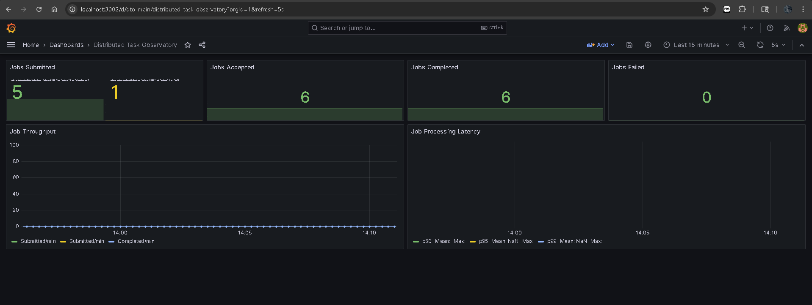
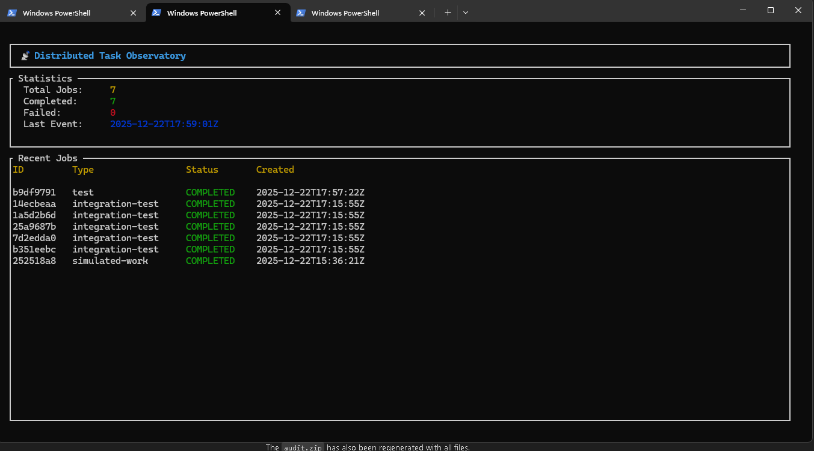

# 📡 Distributed Task Observatory

A self-contained, local-first demonstration platform showcasing modern, production-grade distributed systems.


## 🎯 Overview

The Distributed Task Observatory allows users to submit small "jobs" that flow through a polyglot, event-driven microservice architecture running on Kubernetes. Each job moves through a clear lifecycle—creation, dispatch, execution, success or failure—while emitting structured events, metrics, and alerts that make the system's behavior fully visible end-to-end.

## 🏗️ Architecture


```
┌─────────────┐     ┌─────────────┐     ┌─────────────┐
│   Web UI    │     │  Rust TUI   │     │   Gateway   │
│  (Nginx)    │     │  (ratatui)  │     │  (Node.js)  │
└──────┬──────┘     └──────┬──────┘     └──────┬──────┘
       │                   │                   │
       └───────────────────┴─────────┬─────────┘
                                     │
                              ┌──────▼──────┐
                              │ Read Model  │
                              │    (Go)     │
                              └──────┬──────┘
                                     │
              ┌──────────────────────┼──────────────────────┐
              │                      │                      │
       ┌──────▼──────┐       ┌───────▼───────┐      ┌───────▼───────┐
       │   Redis     │       │  PostgreSQL   │      │   RabbitMQ    │
       │  (Cache)    │       │ (Authoritative)│      │ (Event Spine) │
       └─────────────┘       └───────────────┘      └───────┬───────┘
                                                           │
                              ┌─────────────────────────────┤
                              │                             │
                       ┌──────▼──────┐              ┌───────▼───────┐
                       │  Processor  │              │ Metrics Engine│
                       │  (Python)   │              │     (Go)      │
                       └─────────────┘              └───────────────┘
```

---

## 🚀 Complete Setup Guide (For Beginners)

This guide assumes you're starting from scratch on a Windows machine.

### Step 1: Install Prerequisites

You'll need to install the following tools. Open **PowerShell as Administrator** and run:

#### 1.1 Install Chocolatey (Package Manager)

```powershell
Set-ExecutionPolicy Bypass -Scope Process -Force
[System.Net.ServicePointManager]::SecurityProtocol = [System.Net.ServicePointManager]::SecurityProtocol -bor 3072
iex ((New-Object System.Net.WebClient).DownloadString('https://community.chocolatey.org/install.ps1'))
```

#### 1.2 Install Docker Desktop

```powershell
choco install docker-desktop -y
```

After installation, **restart your computer** and launch Docker Desktop. Wait for it to start completely (whale icon in system tray should be stable).

#### 1.3 Install kubectl (Kubernetes CLI)

```powershell
choco install kubernetes-cli -y
```

#### 1.4 Install kind (Kubernetes in Docker)

```powershell
choco install kind -y
```

#### 1.5 Verify Installations

Open a new PowerShell window and run:

```powershell
docker --version
kubectl version --client
kind --version
```

All three should display version numbers without errors.

---

### Step 2: Clone the Repository

```powershell
git clone https://github.com/YOUR_USERNAME/odd-demonstration.git
cd odd-demonstration
```

---

### Step 3: Create the Kubernetes Cluster

```powershell
.\scripts\setup-cluster.ps1
```

This creates a local Kubernetes cluster named `task-observatory` with ingress support.

**Wait for cluster to be ready** (about 1-2 minutes). You can verify with:

```powershell
kubectl get nodes
```

You should see `task-observatory-control-plane` with status `Ready`.

---

### Step 4: Build All Docker Images

Run these commands from the project root directory:

```powershell
# Core services
docker build -t gateway:latest -f src/services/gateway/Dockerfile .
docker build -t processor:latest -f src/services/processor/Dockerfile .
docker build -t metrics-engine:latest -f src/services/metrics-engine/Dockerfile src/services/metrics-engine
docker build -t read-model:latest -f src/services/read-model/Dockerfile src/services/read-model

# Web UI
docker build -t web-ui:latest -f src/interfaces/web/Dockerfile src/interfaces/web
```

---

### Step 5: Load Images into Kind Cluster

```powershell
kind load docker-image gateway:latest --name task-observatory
kind load docker-image processor:latest --name task-observatory
kind load docker-image metrics-engine:latest --name task-observatory
kind load docker-image read-model:latest --name task-observatory
kind load docker-image web-ui:latest --name task-observatory
```

---

### Step 6: Deploy Everything to Kubernetes

```powershell
kubectl apply -f .\infra\k8s\
```

Wait for all pods to be ready (about 1-2 minutes):

```powershell
kubectl get pods --watch
```

Press `Ctrl+C` when all pods show `1/1 Running`.

---

### Step 7: Access the Services

Since we're using a local cluster, we need to forward ports to access services.

#### Start Port Forwards (run each in a separate terminal)

```powershell
# Terminal 1 - Gateway API
kubectl port-forward svc/gateway 3000:3000

# Terminal 2 - Web Dashboard
kubectl port-forward svc/web-ui 8081:80

# Terminal 3 - Read Model API
kubectl port-forward svc/read-model 8080:8080

# Terminal 4 - RabbitMQ Management
kubectl port-forward svc/rabbitmq 15672:15672

# Terminal 5 - Grafana
kubectl port-forward svc/grafana 3002:3000

# Terminal 6 - Prometheus
kubectl port-forward svc/prometheus 9090:9090
```

#### Access URLs

| Service            | URL                         | Credentials   |
| ------------------ | --------------------------- | ------------- |
| **Web Dashboard**  | http://localhost:8081       | -             |
| **RabbitMQ**       | http://localhost:15672      | guest / guest |
| **Grafana**        | http://localhost:3002       | admin / admin |
| **Prometheus**     | http://localhost:9090       | -             |
| **Gateway API**    | http://localhost:3000       | -             |
| **Read Model API** | http://localhost:8080/stats | -             |



---

### Step 8: Verify Everything Works

Run the integration test:

```powershell
.\scripts\integration-gate.ps1
```

You should see all tests pass:

```
[PASS] Gateway Health
[PASS] Read Model Health
[PASS] Job Submission (5 jobs)
[PASS] Jobs Processed
[PASS] Stats Aggregation
[PASS] Gateway Metrics

[OK] ALL TESTS PASSED - SYSTEM VERIFIED
```

---

## 📊 Using Grafana Dashboards

1. Open http://localhost:3002
2. Login with `admin` / `admin`
3. Go to **Dashboards** in the left menu
4. Click on **Distributed Task Observatory**



The dashboard shows:

- **Jobs Submitted** - Counter of jobs sent to Gateway
- **Jobs Accepted** - Counter of jobs published to RabbitMQ
- **Jobs Completed** - Counter of successfully processed jobs
- **Jobs Failed** - Counter of failed jobs (turns red if > 0)
- **Job Throughput** - Rate of jobs over time
- **Job Processing Latency** - p50, p95, p99 percentiles

---

## 🧪 Submit a Test Job

```powershell
$job = @{
    id = [guid]::NewGuid().ToString()
    type = "test"
    status = "PENDING"
    createdAt = (Get-Date).ToUniversalTime().ToString("yyyy-MM-ddTHH:mm:ssZ")
    payload = @{ message = "Hello World" }
} | ConvertTo-Json

Invoke-RestMethod -Uri "http://localhost:3000/jobs" -Method Post -Body $job -ContentType "application/json"
```

Watch the job appear in:

- http://localhost:8081 (Web Dashboard)
- http://localhost:15672 (RabbitMQ queues)
- http://localhost:3002 (Grafana metrics)

---

## 🖥️ Running the CLI (Rust TUI)

The project includes a terminal-based dashboard built with Rust and `ratatui`.

### Prerequisites: Install Rust

If you don't have Rust installed:

```powershell
# Using Chocolatey
choco install rustup.install -y

# Or download from https://rustup.rs
```

After installation, restart your terminal and verify:

```powershell
rustc --version
cargo --version
```

### Build and Run the TUI

```powershell
# Navigate to the TUI directory
cd src/interfaces/tui

# Build the release version
cargo build --release

# Run the TUI (make sure Read Model is accessible on port 8080)
$env:READ_MODEL_URL="http://localhost:8080"; cargo run --release
```

### TUI Features

- **Real-time stats display** - Jobs Submitted, Completed, Failed
- **Recent jobs table** - Shows last 10 jobs with status
- **Auto-refresh** - Updates every 2 seconds

### Keyboard Controls

| Key | Action        |
| --- | ------------- |
| `q` | Quit the TUI  |
| `r` | Force refresh |

### Expected Output

```
┌────────────────────────────────────────────────────────────┐
│ 📡 Distributed Task Observatory                           │
├────────────────────────────────────────────────────────────┤
│  Total Jobs:     15                                        │
│  Completed:      14                                        │
│  Failed:         1                                         │
│  Last Event:     2025-12-22T18:30:00Z                      │
├────────────────────────────────────────────────────────────┤
│ ID       │ Type           │ Status    │ Created            │
│──────────┼────────────────┼───────────┼────────────────────│
│ abc123.. │ integration    │ COMPLETED │ 2025-12-22T18:29   │
│ def456.. │ test           │ COMPLETED │ 2025-12-22T18:28   │
└────────────────────────────────────────────────────────────┘
```



### Troubleshooting TUI

**"error: linker `link.exe` not found"**

- Install Visual Studio Build Tools: https://visualstudio.microsoft.com/visual-cpp-build-tools/
- Select "Desktop development with C++" workload

**"Unable to connect to the remote server"**

- Make sure the Read Model port-forward is running:
  ```powershell
  kubectl port-forward svc/read-model 8080:8080
  ```

## 🔧 Troubleshooting

### "kubectl: command not found"

Restart your terminal after installing kubectl.

### "Cannot connect to the Docker daemon"

Make sure Docker Desktop is running (whale icon in system tray).

### "pods are stuck in Pending"

Wait a few more minutes. Check status with:

```powershell
kubectl describe pod <pod-name>
```

### "port-forward keeps disconnecting"

This is normal when pods restart. Just run the port-forward command again.

### Images not loading

Make sure you're using `--name task-observatory` in the `kind load` commands.

---

## 📁 Project Structure

```
odd-demonstration/
├── audit/               # Session artifacts and documentation
├── contracts/           # JSON schemas and contracts
├── infra/
│   ├── k8s/            # Kubernetes manifests
│   └── grafana/        # Grafana dashboards
├── scripts/             # Automation scripts
└── src/
    ├── interfaces/
    │   ├── tui/        # Rust TUI (source only)
    │   └── web/        # Web dashboard
    └── services/
        ├── gateway/    # Node.js API
        ├── processor/  # Python worker
        ├── metrics-engine/  # Go aggregator
        └── read-model/      # Go API
```

---

## 🛑 Cleanup

To stop and remove the cluster:

```powershell
kind delete cluster --name task-observatory
```

---

## 📝 License

MIT
