# 📡 Distributed Task Observatory

A self-contained, local-first demonstration platform showcasing modern, production-grade distributed systems.


## 🚀 Quick Start

### Prerequisites

- **Docker Desktop** (running)
  - [Windows](https://docs.docker.com/desktop/install/windows-install/) | [macOS](https://docs.docker.com/desktop/install/mac-install/) | [Linux](https://docs.docker.com/desktop/install/linux-install/)
- **Rust** (for TUI) - [Install](https://rustup.rs)
- **PowerShell Core** (`pwsh`) - Required on all platforms
  - Windows: `winget install Microsoft.PowerShell` (or pre-installed PowerShell)
  - macOS: `brew install powershell`
  - Linux: [Install instructions](https://learn.microsoft.com/en-us/powershell/scripting/install/installing-powershell-on-linux)
- **kubectl** and **kind**
  - Windows: `winget install Kubernetes.kubectl Kubernetes.kind`
  - macOS: `brew install kubectl kind`
  - Linux: See [kind installation](https://kind.sigs.k8s.io/docs/user/quick-start/#installation)

### Option 1: TUI Launcher (Recommended)

```bash
cd src/interfaces/tui
cargo run --release
# Press 'L' when prompted to launch the cluster
```

### Option 2: Script

```bash
# Windows (PowerShell)
.\scripts\start-all.ps1

# macOS/Linux
pwsh ./scripts/start-all.ps1
```

### Option 3: Manual Setup

See [README_beginner.md](./README_beginner.md) for step-by-step instructions (Windows) or the platform-specific guides above.

---

## 🏗️ Architecture



```
┌─────────────┐     ┌─────────────┐     ┌─────────────┐
│   Web UI    │     │  Rust TUI   │     │   Gateway   │
│  (Nginx)    │     │  (ratatui)  │     │  (Node.js)  │
└──────┬──────┘     └──────┬──────┘     └──────┬──────┘
       │                   │                   │
       └───────────────────┴─────────┬─────────┘
                                     │
                              ┌──────▼──────┐
                              │ Read Model  │
                              │    (Go)     │
                              └──────┬──────┘
                                     │
       ┌─────────────────────────────┼─────────────────────────────┐
       │                  │          │          │                  │
┌──────▼──────┐   ┌───────▼───────┐  │  ┌───────▼───────┐  ┌───────▼───────┐
│   Redis     │   │   MongoDB     │  │  │  PostgreSQL   │  │   RabbitMQ    │
│  (Cache)    │   │ (Event Store) │  │  │ (Authoritative)│  │ (Event Spine) │
└─────────────┘   └───────────────┘  │  └───────────────┘  └───────┬───────┘
                                     │                             │
                              ┌──────┴─────────────────────────────┤
                              │                                    │
                       ┌──────▼──────┐                     ┌───────▼───────┐
                       │  Processor  │                     │ Metrics Engine│
                       │  (Python)   │                     │     (Go)      │
                       └─────────────┘                     └───────────────┘
```

---

## 🔗 Access Points

After startup, access services via port-forwards:

| Service            | URL                         | Credentials   |
| ------------------ | --------------------------- | ------------- |
| **Web Dashboard**  | http://localhost:8081       | -             |
| **Gateway API**    | http://localhost:3000       | -             |
| **Read Model API** | http://localhost:8080/stats | -             |
| **RabbitMQ**       | http://localhost:15672      | guest / guest |
| **Grafana**        | http://localhost:3002       | admin / admin |
| **Prometheus**     | http://localhost:9090       | -             |

---

## 🖥️ Interfaces

### Rust TUI

Terminal dashboard with:

- **Cluster launcher** - One-key cluster startup
- **Real-time stats** - Jobs, completions, failures
- **Alerts panel** - Active Prometheus alerts
- **Jobs table** - Recent job status

**Keyboard:**
| Key | Action |
|-----|--------|
| `L` | Launch cluster (launcher mode) |
| `Q` | Quit |
| `R` | Refresh |
| `N` | New Task (placeholder) |

### Web Dashboard

Glassmorphic UI with loading animation, stats, alerts, and job tables.

---

## 🧪 Testing

### Run All Tests

```bash
# Windows
.\scripts\run-all-tests.ps1

# macOS/Linux
pwsh ./scripts/run-all-tests.ps1
```

### Integration Gate

```bash
# Windows
.\scripts\integration-gate.ps1

# macOS/Linux
pwsh ./scripts/integration-gate.ps1
```

### Per-Service Tests

| Service        | Command                                         |
| -------------- | ----------------------------------------------- |
| Gateway        | `cd src/services/gateway && npx vitest run`     |
| Processor      | `cd src/services/processor && pytest tests/ -v` |
| Metrics-Engine | `cd src/services/metrics-engine && go test -v`  |
| Read-Model     | `cd src/services/read-model && go test -v`      |
| TUI            | `cd src/interfaces/tui && cargo test`           |

---

## 📁 Project Structure

```
odd-demonstration/
├── .github/             # CI workflows (GitHub Actions)
├── contracts/           # Event-driven contract layer
│   ├── schemas/         # JSON schemas (event-envelope, job, etc.)
│   ├── fixtures/        # Test fixtures for validation
│   └── VERSIONS.md      # Schema version registry
├── docs/                # Additional documentation
├── infra/
│   ├── k8s/             # Kubernetes manifests (services, mongo, redis, etc.)
│   └── grafana/         # Grafana dashboard JSON
├── scripts/             # Automation & CI scripts
│   ├── start-all.ps1    # One-click cluster startup
│   ├── run-all-tests.ps1
│   ├── integration-gate.ps1
│   ├── check-service-versions.py
│   └── check-schema-compat.py
├── src/
│   ├── interfaces/
│   │   ├── tui/         # Rust TUI (ratatui) with cluster launcher
│   │   └── web/         # Glassmorphic web dashboard (Nginx)
│   └── services/
│       ├── gateway/     # Node.js - API ingress, schema validation
│       ├── processor/   # Python - Job execution worker
│       ├── metrics-engine/  # Go - Event aggregation, MongoDB writer
│       └── read-model/      # Go - Query API (Postgres, MongoDB, Redis)
├── tests/               # Integration test fixtures & determinism docs
├── audit/               # Session artifacts & implementation walkthroughs
└── MODULE.bazel         # Bazel workspace (polyglot build)
```

---

## 🛑 Cleanup

```bash
# Stop port-forwards (Windows PowerShell)
Get-Job | Stop-Job | Remove-Job

# Stop port-forwards (macOS/Linux - if running in background)
pkill -f "kubectl port-forward"

# Delete cluster (all platforms)
kind delete cluster --name task-observatory
```

---

## 📚 Documentation

- [Beginner Setup Guide](./README_beginner.md) - Step-by-step with prerequisites
- [Contributing](./CONTRIBUTING.md) - Development guidelines
- [Audit](./audit/) - Implementation details and walkthroughs

---

## 📝 License

MIT
