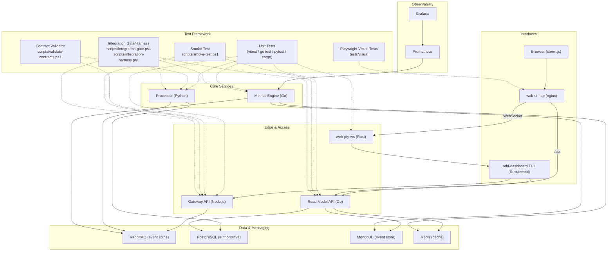

# 📡 Distributed Task Observatory

A self-contained, local-first demonstration platform showcasing modern, production-grade distributed systems designed to enable professional-level agentic development at the most efficient rate possible.

**Test Coverage:**


**Behavioral Tests:**

[](./tests/visual/)

---


[Click here to expand the demo video (MP4)](https://github.com/oddessentials/odd-demonstration/raw/main/screenshots/3.x/demo.mp4)

---

## 🏗️ Architecture




## 🚀 Quick Start (5 minutes)

Get the Distributed Task Observatory running locally with the fewest possible steps.

### 1️⃣ Clone the repo

```bash
git clone https://github.com/oddessentials/odd-demonstration.git
cd odd-demonstration
```

### 2️⃣ Install the dashboard CLI

Choose **one** option:

**Binary (recommended):**

```bash
# macOS / Linux
curl -fsSL https://raw.githubusercontent.com/oddessentials/odd-demonstration/main/install.sh | sh

# Windows (PowerShell)
iwr -useb https://raw.githubusercontent.com/oddessentials/odd-demonstration/main/install.ps1 | iex
```

**npm:**

```bash
npm install -g @oddessentials/odd-dashboard
```

### 3️⃣ Verify prerequisites

```bash
odd-dashboard doctor
```

This checks for Docker Desktop, PowerShell, kubectl, and kind, and tells you exactly what’s missing if anything isn’t installed.

### 4️⃣ Start Docker Desktop

Ensure Docker Desktop is running before continuing.

### 5️⃣ Launch the system

```bash
odd-dashboard
```

That’s it. The TUI will guide you the rest of the way.

➡️ **Next:** Press **L** in the TUI to launch the local cluster.

---

## 🧑‍💻 Developer Quick Start (Guided & Scripted)

This section is for contributors or anyone running the system directly from source.

### Option 1: Rust TUI Launcher (Recommended for dev)

```bash
cd src/interfaces/tui
cargo run --release
```

**What the TUI does:**

1. ✅ Checks Docker, PowerShell, kubectl, and kind
2. 📋 Shows missing tools with install commands
3. 📎 Press **C** to copy a command to your clipboard
4. 🚀 Press **L** to launch the cluster

> 💡 Rust is only required when building the TUI from source.

---

### Option 2: One-shot startup script

Use this if all prerequisites are already installed.

```bash
# Windows
.\scripts\start-all.ps1

# macOS / Linux
pwsh ./scripts/start-all.ps1
```

---

## 🔧 Prerequisites

> The TUI detects and helps you install all of these automatically.

- **Docker Desktop** – container runtime
- **PowerShell Core** – cross-platform scripting
- **kubectl** – Kubernetes CLI
- **kind** – local Kubernetes clusters
- **Rust** – required only for building the TUI from source

---

## 📦 Installation Details

> **Note:** currently releases are unsigned bootstrap builds.
> See [Verifying Releases](./docs/VERIFYING_RELEASES.md) for checksums.

### Verify installation

```bash
odd-dashboard --version
odd-dashboard doctor
```

---

## 🖥️ Interfaces (Quick Overview)

### Rust TUI

- Guided setup & diagnostics
- One-key cluster launch
- Real-time job and system stats
- Alerts from Prometheus
- Built-in UI launcher

**Keyboard shortcuts:**

| Key | Action         |
| --- | -------------- |
| `L` | Launch cluster |
| `N` | New task       |
| `U` | UI launcher    |
| `R` | Refresh        |
| `Q` | Quit           |

---

### Web Terminal

- Browser-based terminal powered by xterm.js
- Pixel-accurate TUI mirroring via PTY streaming
- Session reconnect on refresh
- Fallback dashboard when terminal is unavailable

### Supported Platforms

| OS      | Architecture  | Artifact                        |
| ------- | ------------- | ------------------------------- |
| Windows | x64           | `odd-dashboard-windows-x64.exe` |
| macOS   | Intel         | `odd-dashboard-macos-x64`       |
| macOS   | Apple Silicon | `odd-dashboard-macos-arm64`     |
| Linux   | x64           | `odd-dashboard-linux-x64`       |
| Linux   | ARM64         | `odd-dashboard-linux-arm64`     |

**System Requirements:** 8GB RAM minimum (16GB recommended), 4+ CPU cores, 15GB disk.
See [Support Matrix](./docs/SUPPORT_MATRIX.md) for full hardware requirements and Docker Desktop configuration.

## 🔗 Access Points

After startup, access services via port-forwards:

| Service            | URL                         | Credentials               |
| ------------------ | --------------------------- | ------------------------- |
| **Web Terminal**   | http://localhost:8081       | -                         |
| **Gateway API**    | http://localhost:3000       | -                         |
| ↳ API Docs         | http://localhost:3000/docs  | -                         |
| **Read Model API** | http://localhost:8080/stats | -                         |
| ↳ API Docs         | http://localhost:8080/docs  | -                         |
| **RabbitMQ**       | http://localhost:15672      | guest / guest             |
| **Grafana**        | http://localhost:3002       | admin / admin             |
| **Prometheus**     | http://localhost:9090       | -                         |
| **pgAdmin**        | http://localhost:5050       | admin@example.com / admin |
| **Mongo Express**  | http://localhost:8082       | admin / password123       |
| **RedisInsight**   | http://localhost:8001       | -                         |

---

## 🐳 Docker Hub Images

Pre-built container images are published to Docker Hub for faster integration testing and CI reproducibility.

[View on docker hub here](https://hub.docker.com/u/oddessentials)

### Available Images

| Image                                      | Base             | Size    | Purpose                          |
| ------------------------------------------ | ---------------- | ------- | -------------------------------- |
| `oddessentials/odto-gateway:latest`        | node:20-slim     | ~320 MB | API Gateway (Node.js/TypeScript) |
| `oddessentials/odto-processor:latest`      | python:3.11-slim | ~490 MB | Job Processor (Python)           |
| `oddessentials/odto-metrics-engine:latest` | distroless       | ~23 MB  | Metrics Aggregator (Go)          |
| `oddessentials/odto-read-model:latest`     | distroless       | ~20 MB  | Query API (Go)                   |
| `oddessentials/odto-web-pty-server:latest` | rust:alpine      | ~50 MB  | PTY WebSocket Server (Rust)      |

### Usage

```bash
# Pull latest images
docker pull oddessentials/odto-gateway:latest
docker pull oddessentials/odto-processor:latest
docker pull oddessentials/odto-metrics-engine:latest
docker pull oddessentials/odto-read-model:latest

# Run integration tests with pre-built images
docker compose -f docker-compose.integration.yml up -d
```

### Image Tagging

- `:latest` — Current `main` branch build
- `:sha-<commit>` — Exact commit traceability

### CI Integration

Images are automatically built and pushed on every merge to `main`:

- Security: Build/push only runs on `main`, never on PRs or forks
- Contracts are baked into Gateway and Processor images for self-contained tests
- Integration tests use these pre-built images for <90s runtime (I4 invariant)

## 🧪 Testing

### Run All Tests

```bash
# Windows
.\scripts\run-all-tests.ps1

# macOS/Linux
pwsh ./scripts/run-all-tests.ps1
```

### Integration Gate

```bash
# Windows
.\scripts\integration-gate.ps1

# macOS/Linux
pwsh ./scripts/integration-gate.ps1
```

### Per-Service Tests

| Service        | Command                                         |
| -------------- | ----------------------------------------------- |
| Gateway        | `cd src/services/gateway && npx vitest run`     |
| Processor      | `cd src/services/processor && pytest tests/ -v` |
| Metrics-Engine | `cd src/services/metrics-engine && go test -v`  |
| Read-Model     | `cd src/services/read-model && go test -v`      |
| TUI            | `cd src/interfaces/tui && cargo test`           |

---

## 📁 Project Structure

```
odd-demonstration/
├── .github/             # CI workflows (GitHub Actions)
├── contracts/           # Event-driven contract layer
│   ├── schemas/         # JSON schemas (event-envelope, job, etc.)
│   ├── fixtures/        # Test fixtures for validation
│   └── VERSIONS.md      # Schema version registry
├── docs/                # Additional documentation
├── infra/
│   ├── k8s/             # Kubernetes manifests (services, mongo, redis, etc.)
│   └── grafana/         # Grafana dashboard JSON
├── scripts/             # Automation & CI scripts
│   ├── start-all.ps1    # One-click cluster startup
│   ├── run-all-tests.ps1
│   ├── integration-gate.ps1
│   ├── check-service-versions.py
│   └── check-schema-compat.py
├── src/
│   ├── interfaces/
│   │   ├── tui/         # Rust TUI (ratatui) with cluster launcher
│   │   └── web/         # Glassmorphic web dashboard (Nginx)
│   └── services/
│       ├── gateway/         # Node.js - API ingress, schema validation
│       ├── processor/       # Python - Job execution worker
│       ├── metrics-engine/  # Go - Event aggregation, MongoDB writer
│       ├── read-model/      # Go - Query API (Postgres, MongoDB, Redis)
│       └── web-pty-server/  # Rust - PTY WebSocket streaming
├── tests/
│   ├── visual/          # Playwright visual regression tests
│   └── fixtures/        # Integration test fixtures
├── audit/               # Session artifacts & implementation walkthroughs
└── MODULE.bazel         # Bazel workspace (polyglot build)
```

---

## 🛑 Cleanup

```bash
# Stop port-forwards (Windows PowerShell)
Get-Job | Stop-Job | Remove-Job

# Stop port-forwards (macOS/Linux - if running in background)
pkill -f "kubectl port-forward"

# Delete cluster (all platforms)
kind delete cluster --name task-observatory
```

---

## 📚 Documentation

- [Beginner Setup Guide](./README_beginner.md) - Step-by-step with prerequisites
- [Contributing](./CONTRIBUTING.md) - Development guidelines
- [Audit](./audit/) - Implementation details and walkthroughs

---

## 📝 License

MIT
