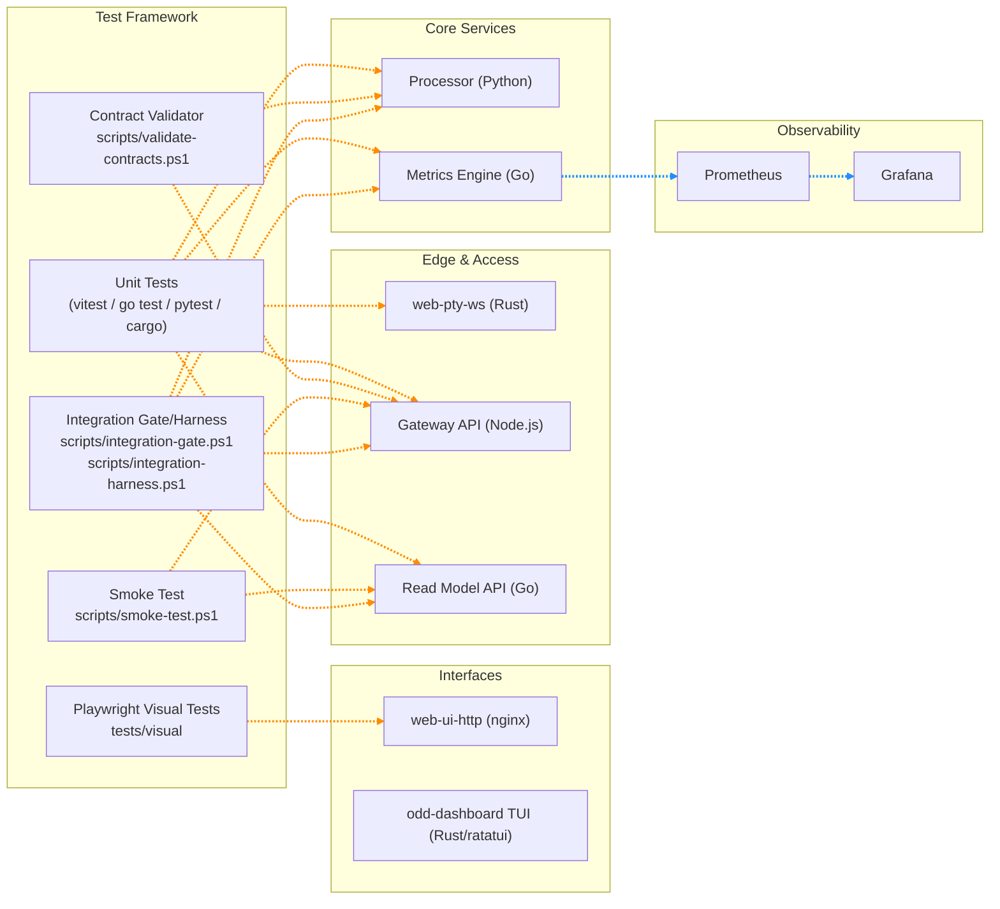

# 📡 Test & Observability View

- Verification and monitoring

```mermaid
flowchart LR
  %% NOTE:
  %% linkStyle indices are order-dependent.
  %% If you add/remove edges above, update the linkStyle indices below.

  subgraph Interfaces
    WebUI["web-ui-http (nginx)"]
    TUI["odd-dashboard TUI (Rust/ratatui)"]
  end

  subgraph EdgeServices["Edge & Access"]
    WebPTY["web-pty-ws (Rust)"]
    Gateway["Gateway API (Node.js)"]
    ReadModel["Read Model API (Go)"]
  end

  subgraph CoreServices["Core Services"]
    Processor["Processor (Python)"]
    Metrics["Metrics Engine (Go)"]
  end

  subgraph Observability
    Prometheus["Prometheus"]
    Grafana["Grafana"]
  end

  subgraph Testing["Test Framework"]
    Unit["Unit Tests\n(vitest / go test / pytest / cargo)"]
    Contracts["Contract Validator\nscripts/validate-contracts.ps1"]
    Smoke["Smoke Test\nscripts/smoke-test.ps1"]
    Integration["Integration Gate/Harness\nscripts/integration-gate.ps1\nscripts/integration-harness.ps1"]
    Visual["Playwright Visual Tests\ntests/visual"]
  end

  %% Observability edges (BLUE)
  Metrics -.-> Prometheus
  Prometheus -.-> Grafana

  %% Test framework edges (ORANGE)
  Unit -.-> Gateway
  Unit -.-> Processor
  Unit -.-> Metrics
  Unit -.-> ReadModel
  Unit -.-> WebPTY
  Contracts -.-> Gateway
  Contracts -.-> Processor
  Smoke -.-> Gateway
  Smoke -.-> ReadModel
  Integration -.-> Gateway
  Integration -.-> ReadModel
  Integration -.-> Processor
  Integration -.-> Metrics
  Visual -.-> WebUI

  %% Edge styling by semantic group

  %% Observability edges (indices 0–1)
  linkStyle 0 stroke:#1E90FF,stroke-width:3px;
  linkStyle 1 stroke:#1E90FF,stroke-width:3px;

  %% Test framework edges (indices 2–15)
  linkStyle 2 stroke:#FF8C00,stroke-width:2.5px;
  linkStyle 3 stroke:#FF8C00,stroke-width:2.5px;
  linkStyle 4 stroke:#FF8C00,stroke-width:2.5px;
  linkStyle 5 stroke:#FF8C00,stroke-width:2.5px;
  linkStyle 6 stroke:#FF8C00,stroke-width:2.5px;
  linkStyle 7 stroke:#FF8C00,stroke-width:2.5px;
  linkStyle 8 stroke:#FF8C00,stroke-width:2.5px;
  linkStyle 9 stroke:#FF8C00,stroke-width:2.5px;
  linkStyle 10 stroke:#FF8C00,stroke-width:2.5px;
  linkStyle 11 stroke:#FF8C00,stroke-width:2.5px;
  linkStyle 12 stroke:#FF8C00,stroke-width:2.5px;
  linkStyle 13 stroke:#FF8C00,stroke-width:2.5px;
  linkStyle 14 stroke:#FF8C00,stroke-width:2.5px;
  linkStyle 15 stroke:#FF8C00,stroke-width:2.5px;
```

**Legend**

- 🟧 Orange: Test framework pressure
- 🟦 Blue: Observability / monitoring
