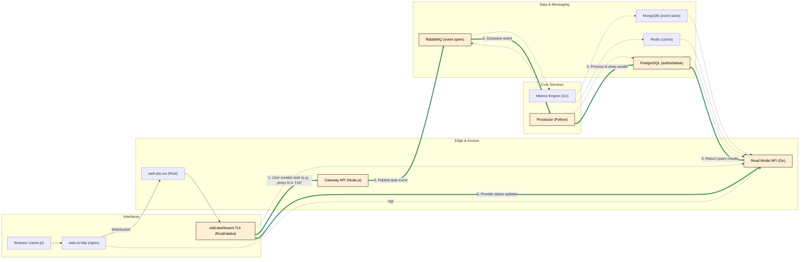

# ⚙️ Runtime View

- How the system runs

```mermaid
flowchart LR
  %% NOTE:
  %% linkStyle indices are order-dependent.
  %% If you add/remove edges above, update the linkStyle indices below.

  subgraph Interfaces
    Browser["Browser (xterm.js)"]
    WebUI["web-ui-http (nginx)"]
    TUI["odd-dashboard TUI (Rust/ratatui)"]
  end

  subgraph EdgeServices["Edge & Access"]
    WebPTY["web-pty-ws (Rust)"]
    Gateway["Gateway API (Node.js)"]
    ReadModel["Read Model API (Go)"]
  end

  subgraph CoreServices["Core Services"]
    Processor["Processor (Python)"]
    Metrics["Metrics Engine (Go)"]
  end

  subgraph Data["Data & Messaging"]
    RabbitMQ["RabbitMQ (event spine)"]
    Postgres["PostgreSQL (authoritative)"]
    Mongo["MongoDB (event store)"]
    Redis["Redis (cache)"]
  end

  %% Core runtime connections
  Browser --> WebUI
  WebUI -->|WebSocket| WebPTY
  WebPTY --> TUI
  WebUI -.->|/api| ReadModel
  TUI -.-> ReadModel

  Processor -.-> Postgres
  Postgres -.-> ReadModel
  Mongo -.-> ReadModel
  Metrics -.-> Mongo
  Redis -.-> ReadModel
  Metrics -.-> Redis
  Processor -.-> RabbitMQ
  RabbitMQ -.-> Metrics

  %% Task creation flow (GREEN, steps 1–6)
  TUI -->|"1. User creates task (e.g., press N in TUI)"| Gateway
  Gateway -->|"2. Publish task event"| RabbitMQ
  RabbitMQ -->|"3. Consume event"| Processor
  Processor -->|"4. Process & write results"| Postgres
  Postgres -->|"5. Return query results"| ReadModel
  ReadModel -->|"6. Provide status updates"| TUI

  %% Node styling
  classDef flowNode fill:#FFEFD5,stroke:#333,stroke-width:1.5px,color:#000;
  class TUI,Gateway,RabbitMQ,Processor,Postgres,ReadModel flowNode;

  %% Task flow edges (last 6 edges)
  linkStyle 13 stroke:#2E8B57,stroke-width:4px;
  linkStyle 14 stroke:#2E8B57,stroke-width:4px;
  linkStyle 15 stroke:#2E8B57,stroke-width:4px;
  linkStyle 16 stroke:#2E8B57,stroke-width:4px;
  linkStyle 17 stroke:#2E8B57,stroke-width:4px;
  linkStyle 18 stroke:#2E8B57,stroke-width:4px;
```

**Legend**

- 🟩 Green: Primary task execution flow
