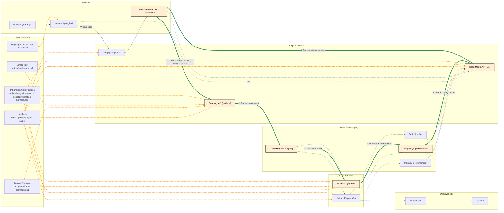

# 🏗️ Architecture

- System diagram

```mermaid
flowchart LR
    %% NOTE:
    %% linkStyle indices are order-dependent.
    %% If you add/remove edges above, update the linkStyle ranges below.

    subgraph Interfaces
        Browser["Browser (xterm.js)"]
        WebUI["web-ui-http (nginx)"]
        TUI["odd-dashboard TUI (Rust/ratatui)"]
    end
    subgraph EdgeServices["Edge & Access"]
        WebPTY["web-pty-ws (Rust)"]
        Gateway["Gateway API (Node.js)"]
        ReadModel["Read Model API (Go)"]
    end
    subgraph CoreServices["Core Services"]
        Processor["Processor (Python)"]
        Metrics["Metrics Engine (Go)"]
    end
    subgraph Data["Data & Messaging"]
        RabbitMQ["RabbitMQ (event spine)"]
        Postgres["PostgreSQL (authoritative)"]
        Mongo["MongoDB (event store)"]
        Redis["Redis (cache)"]
    end
    subgraph Observability
        Prometheus["Prometheus"]
        Grafana["Grafana"]
    end
    subgraph Testing["Test Framework"]
        Unit["Unit Tests\n(vitest / go test / pytest / cargo)"]
        Contracts["Contract Validator\nscripts/validate-contracts.ps1"]
        Smoke["Smoke Test\nscripts/smoke-test.ps1"]
        Integration["Integration Gate/Harness\nscripts/integration-gate.ps1\nscripts/integration-harness.ps1"]
        Visual["Playwright Visual Tests\ntests/visual"]
    end

    %% ─────────────────────────────────────
    %% Core runtime connections
    Browser --> WebUI
    WebUI -->|WebSocket| WebPTY
    WebPTY --> TUI
    WebUI -.->|/api| ReadModel
    TUI -.-> ReadModel
    Processor -.-> Postgres
    Postgres -.-> ReadModel
    Mongo -.-> ReadModel
    Metrics -.-> Mongo
    Redis -.-> ReadModel
    Metrics -.-> Redis
    Processor -.-> RabbitMQ
    RabbitMQ -.-> Metrics

    %% Observability (BLUE)
    Metrics -.-> Prometheus
    Prometheus -.-> Grafana

    %% ─────────────────────────────────────
    %% Test framework connections (ORANGE)
    Unit -.-> Gateway
    Unit -.-> Processor
    Unit -.-> Metrics
    Unit -.-> ReadModel
    Unit -.-> WebPTY
    Contracts -.-> Gateway
    Contracts -.-> Processor
    Smoke -.-> Gateway
    Smoke -.-> ReadModel
    Integration -.-> Gateway
    Integration -.-> ReadModel
    Integration -.-> Processor
    Integration -.-> Metrics
    Visual -.-> WebUI

    %% ─────────────────────────────────────
    %% Task creation flow (GREEN, steps 1–6)
    TUI -->|"1. User creates task (e.g., press N in TUI)"| Gateway
    Gateway -->|"2. Publish task event"| RabbitMQ
    RabbitMQ -->|"3. Consume event"| Processor
    Processor -->|"4. Process & write results"| Postgres
    Postgres -->|"5. Return query results"| ReadModel
    ReadModel -->|"6. Provide status updates"| TUI

    %% ─────────────────────────────────────
    %% Node styling
    classDef flowNode fill:#FFEFD5,stroke:#333,stroke-width:1.5px,color:#000;
    class TUI,Gateway,RabbitMQ,Processor,Postgres,ReadModel flowNode;

    %% ─────────────────────────────────────
    %% Edge styling by semantic group
    %% (Indices assume the edge order above remains unchanged)

    %% Observability edges (blue)
    linkStyle 13 stroke:#1E90FF,stroke-width:3px;
    linkStyle 14 stroke:#1E90FF,stroke-width:3px;

    %% Test framework edges (orange)
    linkStyle 15 stroke:#FF8C00,stroke-width:2.5px;
    linkStyle 16 stroke:#FF8C00,stroke-width:2.5px;
    linkStyle 17 stroke:#FF8C00,stroke-width:2.5px;
    linkStyle 18 stroke:#FF8C00,stroke-width:2.5px;
    linkStyle 19 stroke:#FF8C00,stroke-width:2.5px;
    linkStyle 20 stroke:#FF8C00,stroke-width:2.5px;
    linkStyle 21 stroke:#FF8C00,stroke-width:2.5px;
    linkStyle 22 stroke:#FF8C00,stroke-width:2.5px;
    linkStyle 23 stroke:#FF8C00,stroke-width:2.5px;
    linkStyle 24 stroke:#FF8C00,stroke-width:2.5px;
    linkStyle 25 stroke:#FF8C00,stroke-width:2.5px;
    linkStyle 26 stroke:#FF8C00,stroke-width:2.5px;
    linkStyle 27 stroke:#FF8C00,stroke-width:2.5px;
    linkStyle 28 stroke:#FF8C00,stroke-width:2.5px;

    %% Task flow edges (green)
    linkStyle 29 stroke:#2E8B57,stroke-width:4px;
    linkStyle 30 stroke:#2E8B57,stroke-width:4px;
    linkStyle 31 stroke:#2E8B57,stroke-width:4px;
    linkStyle 32 stroke:#2E8B57,stroke-width:4px;
    linkStyle 33 stroke:#2E8B57,stroke-width:4px;
    linkStyle 34 stroke:#2E8B57,stroke-width:4px;
```

**Legend**

- 🟩 Green: Primary task execution flow
- 🟧 Orange: Test framework pressure
- 🟦 Blue: Observability / monitoring
